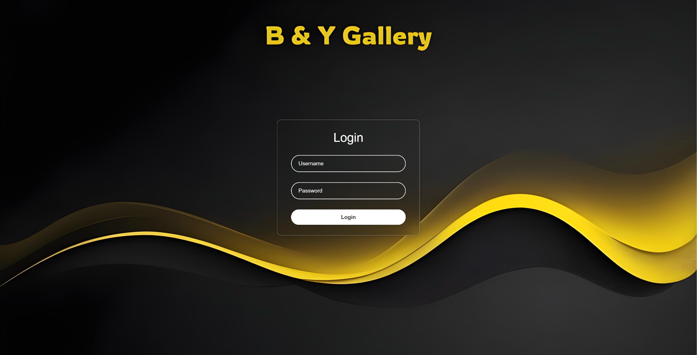
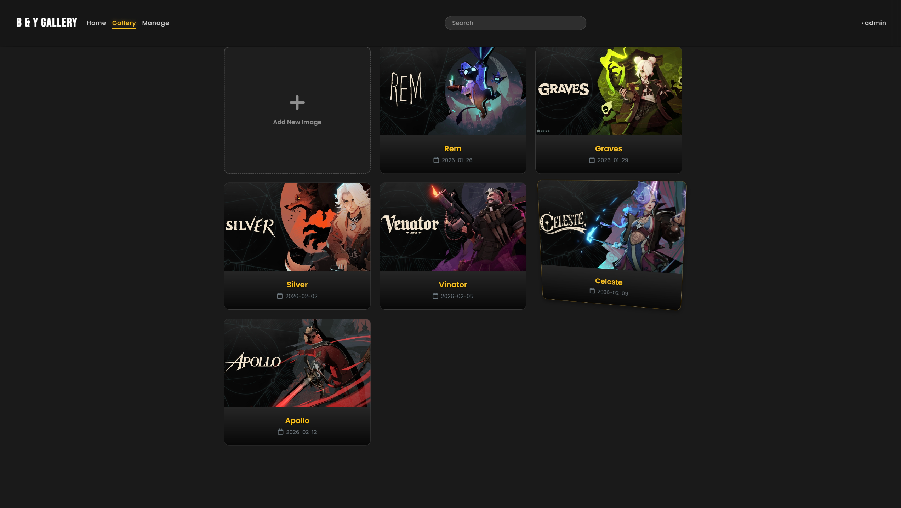
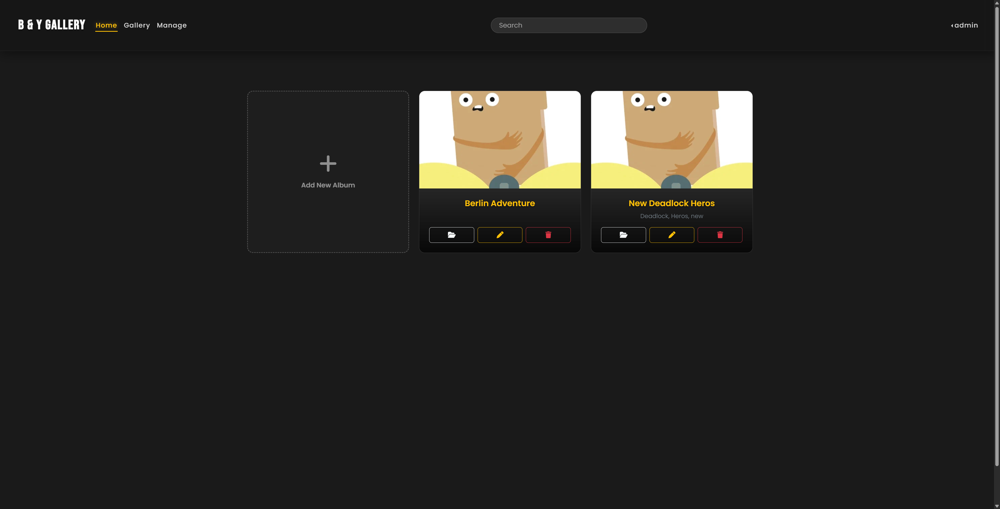
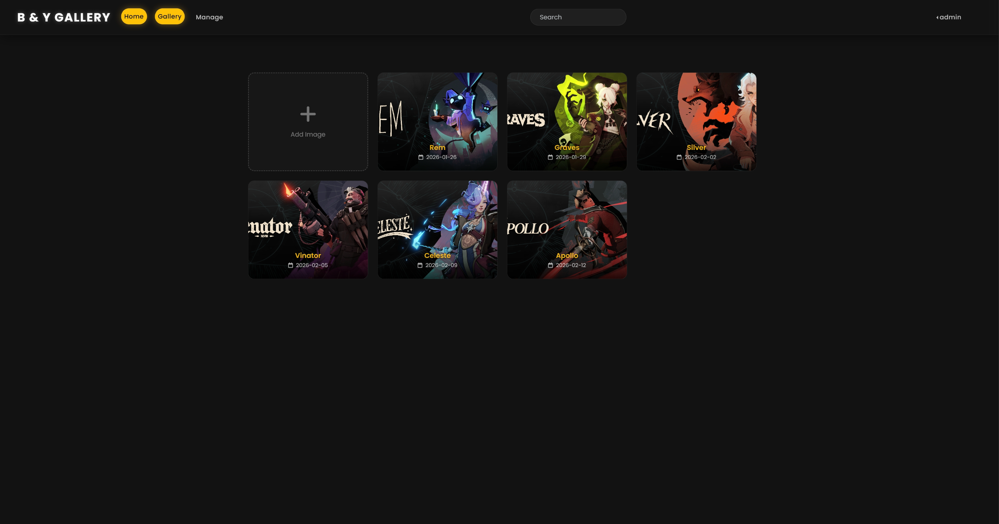
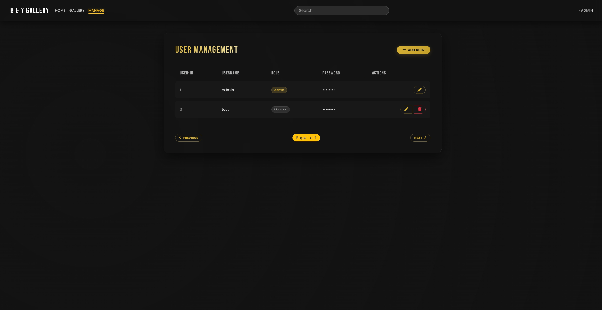

# 📸 FotoLab — Photo Gallery WebApp

A full-stack photo gallery application for uploading, organizing, and managing photos in albums with a sleek, modern dark-themed UI.

 





---

## ✨ Features

- **Authentication** — Secure login & registration with bcrypt-hashed passwords
- **Gallery** — Upload and browse photos in a responsive, interactive grid
- **Albums** — Create albums, add/remove images, and organize with tags
- **Search** — Filter images and albums by title or tags
- **Lightbox** — Full-screen image preview with edit and delete options
- **Admin Panel** — User management dashboard for admin users
- **Responsive UI** — Dark-themed glassmorphism design with 3D hover effects

---

## 🛠️ Tech Stack

| Layer | Technologies |
|---|---|
| **Frontend** | HTML5, TypeScript, CSS3, [Bootstrap 5](https://getbootstrap.com/), [Vanilla-Tilt.js](https://micku7zu.github.io/vanilla-tilt.js/) |
| **Backend** | Java, [Vert.x](https://vertx.io/) (Web, Auth, Sessions) |
| **Database** | MariaDB |
| **Server** | Express.js (static file serving) |

---

## 📁 Project Structure

```
B&Y - WebAPP/
├── B&Y - Backend/          # Java Vert.x backend (API server on port 8888)
├── src/main/java/      # Handler classes (Auth, User, Album, Image, Upload)
│   └── uploads/            # Uploaded image files (created at runtime)
├── B&Y - Frontend/         # Frontend application (served on port 3000)
│   ├── public/             # Static files (HTML, CSS, compiled JS)
│   │   ├── gallery/        # Gallery page
│   │   ├── albums/         # Albums page
│   │   ├── albumImage/     # Album images page
│   │   └── adminUi/        # Admin panel
│   └── app.js              # Express server
├── fotolab.sql             # Database schema & seed data
└── README.md
```

---

## 🚀 Getting Started

### Prerequisites

- **Java 17+** and **Maven**
- **Node.js** and **npm**
- **MariaDB** (or MySQL)

### 1. Database Setup

1. Make sure MariaDB is installed and running.
2. Import the database schema:
   ```sh
   mariadb -u root -p < fotolab.sql
   ```
   Or use a GUI tool like **phpMyAdmin** or **HeidiSQL** to import `fotolab.sql`.

3. The script will create the `fotolab` database with all tables and a default admin user.

### 2. Backend Setup

1. Open the `B&Y - Backend` folder in your IDE (IntelliJ IDEA, Eclipse, or VS Code).
2. Install Maven dependencies:
   ```sh
   mvn clean install
   ```
3. Run the main class:
   ```
   de.thm.mni.pi2.adder.MainVerticle
   ```
4. The API server starts at **http://localhost:8888**

#### Environment Variables (Optional)

| Variable | Default | Description |
|---|---|---|
| `DB_HOST` | `localhost` | Database host |
| `DB_PORT` | `3306` | Database port |
| `DB_NAME` | `fotolab` | Database name |
| `DB_USER` | `root` | Database user |
| `DB_PASS` | *(empty)* | Database password |

### 3. Frontend Setup

1. Navigate to the frontend directory:
   ```sh
   cd "B&Y - Frontend"
   ```
2. Install dependencies:
   ```sh
   npm install
   ```
3. Compile TypeScript (if needed):
   ```sh
   npm run build
   ```
4. Start the server:
   ```sh
   npm start
   ```
5. Open **http://localhost:3000** in your browser.

---

## 🔐 Default Credentials

| Username | Password | Role |
|---|---|---|
| `admin` | `admin` | Admin |

> **Note:** It is recommended to change the default password after first login.

---

## 📡 API Endpoints

| Method | Endpoint | Description |
|---|---|---|
| `POST` | `/login` | User login |
| `POST` | `/logout` | User logout |
| `GET` | `/user` | Get current user info |
| `GET` | `/userroles` | Get current user roles |
| `GET` | `/users` | Get all users (admin) |
| `POST` | `/users` | Register new user |
| `PUT` | `/users/:id` | Update user |
| `DELETE` | `/users/:id` | Delete user |
| `GET` | `/user/images` | Get user's images |
| `GET` | `/user/images/:id` | Get image details |
| `POST` | `/images` | Add new image |
| `PUT` | `/images` | Update image |
| `DELETE` | `/images/:id` | Delete image |
| `POST` | `/upload` | Upload image file |
| `GET` | `/user/albums` | Get user's albums |
| `POST` | `/albums` | Create album |
| `PUT` | `/albums/:id` | Update album |
| `DELETE` | `/albums/:id` | Delete album |
| `GET` | `/albums/:id/albumimages` | Get album images |
| `POST` | `/albums/images` | Add image to album |
| `DELETE` | `/albums/:albumid/images/:imageid` | Remove image from album |

---

## 📄 License

This project was built as part of a university course.
